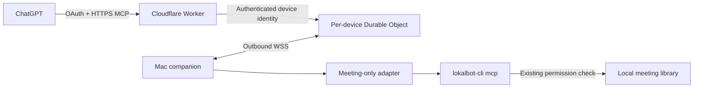

# LokalBot for ChatGPT

A public-plugin implementation using [OpenAI MCP Extensions](https://github.com/openai/mcp-extensions): meeting recall, commitments, person briefings, a meeting-library panel, and composer meeting mentions.

Each user pairs their own Mac through OAuth. The library remains on that Mac; requested results travel through a Cloudflare relay to ChatGPT. The companion delegates every library read to `lokalbot-cli mcp`, so LokalBot's meeting-library permission remains authoritative. Screen memory, inference, writes, and Agent Mode are not exposed.

**Preview status:** the relay is live at `https://mcp.lokalbot.com`. The [signed and notarized preview companion](https://github.com/stevyhacker/LokalBot/releases/tag/chatgpt-plugin-v0.1.0-preview.1) is published and its public download has passed signature, notarization, and synthetic live-connection checks. It bundles the compatible CLI without replacing the installed app: the installed 0.10.2 helper was observed waiting for a full input buffer during an interactive MCP handshake. The public ChatGPT listing, registered plugin ID, and ChatGPT host validation remain pending. See the [setup instructions](docs/PREVIEW.md) and [validation record](docs/VALIDATION.md).

## Build and verify

Use Node 22.12+ (Node 24 LTS recommended).

```sh
cd Distribution/chatgpt-plugin
npm ci --ignore-scripts
npm run check
npm run build:relay
```

Build products:

| Path | Purpose |
| --- | --- |
| `dist/companion/` | Mac connection helper, adapter, and bundled panel. Needs Node, no npm install. |
| `dist/local-plugin/` | Stdio plugin for local desktop development. |
| `dist/relay.js` | Worker bundle exercised by protocol tests. |
| `.cloudflare/output/` | `cf build` deployment output. |
| `dist/public-plugin/` | Created separately after a real deployment passes discovery checks. |
| `dist/preview/` | Separate Mac companion including the branch-built native CLI, staged by `scripts/package-preview.mjs`. |

On macOS, Xcode and XcodeGen can build only the actual CLI target for an integration check. It uses the repository's source list and ArgumentParser revision, and does not build, launch, sign, or install the app:

```sh
npm run build:test-cli
LOKALBOT_TEST_CLI="$PWD/.test-cli/DerivedData/Build/Products/Debug/lokalbot-cli" npm test
```

This test creates a temporary synthetic library, starts the packaged adapter against it, checks summary/transcript selection, grants access only inside the fixture, then revokes it. Without `LOKALBOT_TEST_CLI`, that one test is explicitly skipped. OAuth tests use the real Workers runtime with synthetic users, and WebSocket tests use loopback listeners. No test reads the installed library or runs a browser.

The [CI workflow](../../.github/workflows/chatgpt-plugin.yml) covers the TypeScript build, Worker build, protocol suite, and native CLI integration. Browser and host rendering checks must run in hosted CI or on a remote runner; they have not been established by these backend checks.

Tags matching `chatgpt-plugin-vX.Y.Z-preview.N` run those checks before building the Release CLI, signing the companion, notarizing and stapling a DMG, and publishing a separate GitHub prerelease. This does not update the stable app or its Sparkle feed. `SOURCE.json` records the exact source commit.

## Connection and architecture



[Connect a Mac](docs/CONNECT.md) describes pairing, running, and revoking the companion. There is no inbound port, library synchronization, background bulk upload, or automatic permission change. The first version uses a foreground Node process; it is not yet an installed app setting or login item.

The public MCP endpoint is stateless Streamable HTTP at `/mcp`. OAuth grants bind a device id and generation; caller-supplied tenant headers never choose a device. Device credentials are 256-bit secrets stored only in an owner-readable local file; the relay stores hashes. Pairing codes are 128-bit, expire in ten minutes, and are consumed atomically. The consent page uses the OAuth provider's browser-bound transaction and PKCE S256. It shows the requesting client and redirect host before sharing is authorized.

Access tokens last 15 minutes and refresh grants up to 30 days. Revoking a device deletes its authorization and closes its socket, so existing and refreshed tokens cannot reach the library. Initial unused devices expire after one day; connected devices expire after up to 90 days offline. Stopping the companion makes the device unavailable without deleting its pairing. Heartbeats, bounded concurrency, replacement detection, and timeouts handle sleep and broken connections.

## Data and permissions

- Six allowlisted CLI tools: `list_meetings`, `search_meetings`, `get_meeting`, `get_action_items`, `list_people`, and `get_person`. The adapter adds the panel opener and app-only mention search. No generic CLI or shell proxy exists.
- Summary and metadata retrieval are the default. Transcript excerpts require `include_transcript: true`; the requested window defaults to 8,000 characters and is capped at 20,000. The CLI preserves whole entries, so one long entry can exceed the requested target. Relay responses are capped at 2 MiB.
- Incoming RPC payloads must fit 64 KiB. Each device allows eight in-flight calls. Requests time out after 20 seconds. Reconnection does not replay requests automatically.
- Mentions return `lokalbot://meetings/<uuid>` references. Resolving a reference checks permission again. Meeting text is source material, not instructions.
- The panel renders text without executing meeting HTML and has no external resource domains or browser persistence. Refreshing after a permission denial clears the previous results. Already returned content cannot be recalled from ChatGPT.
- Neither adapter nor relay saves meeting results. Durable storage holds pairing/authentication metadata; OAuth storage also holds client registrations, consent transactions, and grants. Cloudflare and OpenAI still process network traffic under their terms. This is TLS-protected, not end-to-end encrypted against the relay operator.
- Logs are disabled in the Worker configuration, and application errors avoid local filesystem diagnostics and credentials. Deployment-level access logging must be checked separately.

The app's [privacy contract](../../PRIVACY.md) and [public launch runbook](docs/DEPLOYMENT.md) describe these boundaries. Nothing here changes capture, retention, remote-inference consent, or screen-memory permissions.

## Public packaging

After deploying the approved origin:

```sh
npm run package:public -- --origin https://YOUR_DEPLOYED_ORIGIN
```

The command probes service health, OAuth discovery, and the unauthenticated challenge before creating `dist/public-plugin/` with a remote `streamable-http` configuration. It copies only the manifest, skills, documentation, license, and icon. It includes no local runtime, credentials, or test fixtures.

For a desktop test package linked to an already registered ChatGPT connection, add `--app-id` with its actual `plugin_asdk_app_...` ID. This emits the registered `.app.json` mapping instead of a second MCP server entry. Packaging does not register, upload, submit, or publish anything.

Public distribution follows OpenAI's [remote MCP submission](https://developers.openai.com/plugins/guides/submit-claude-plugin) and [packaging](https://developers.openai.com/plugins/build/plugins) workflows. A local stdio package or private [Secure MCP Tunnel](https://developers.openai.com/api/docs/guides/secure-mcp-tunnels) is useful for development, but does not supply the public endpoint.

## Local development

Point a compatible desktop host at `dist/local-plugin/`, or run `node dist/server.js` over stdio. By default it uses `/Applications/LokalBot.app/Contents/Helpers/lokalbot-cli`. Set `LOKALBOT_CLI_PATH` to another absolute helper path for source builds. `LOKALBOT_STORAGE_ROOT` selects a synthetic fixture. Agent Mode capability variables and cloud credentials are not passed to the CLI.

Keep the entire package together. Never expose the stdio adapter through an unauthenticated public proxy. The relay already supplies the public authentication boundary.
