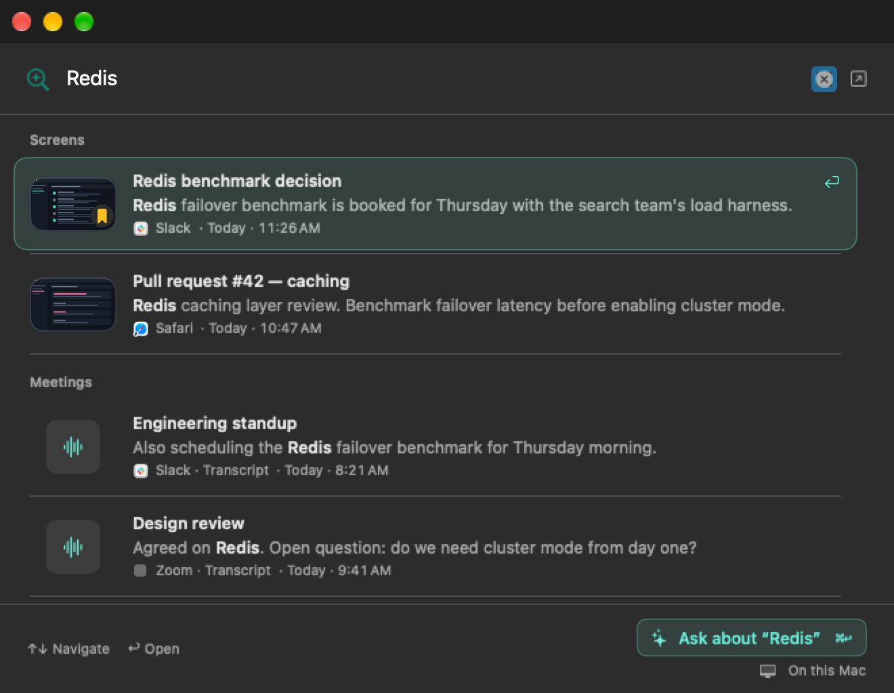
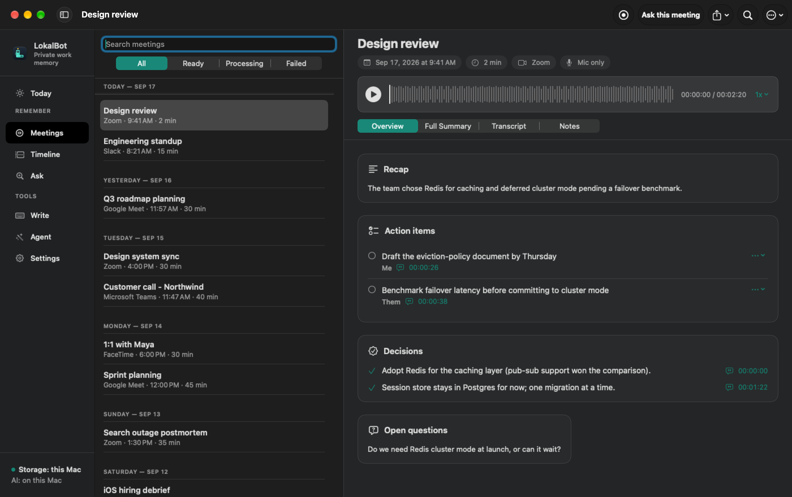
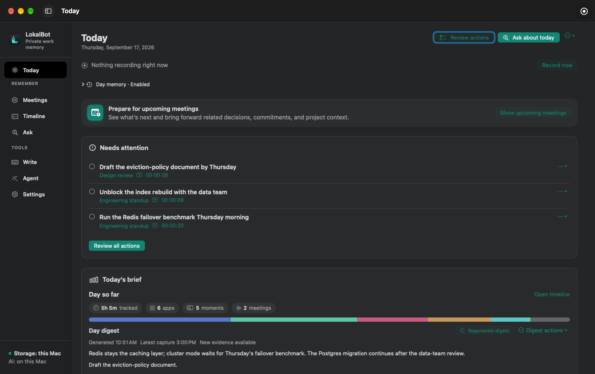
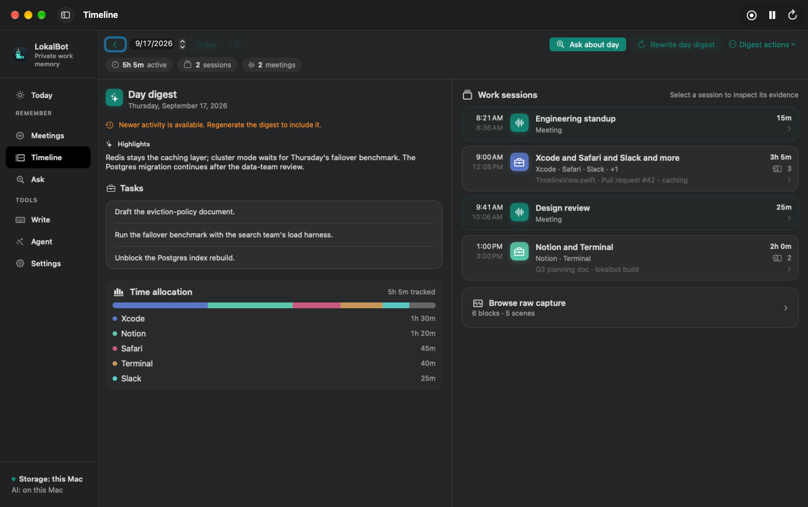
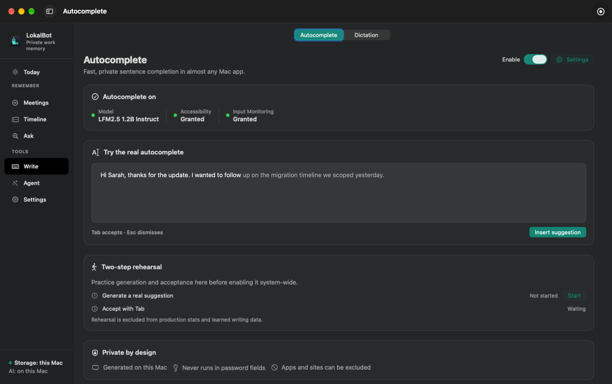
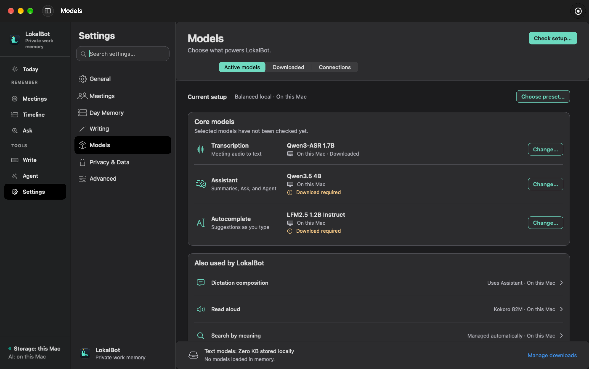

<div align="center">


# LokalBot

**Find what you said or saw on your Mac.**

Turn meetings into searchable notes. Find the page you had open. Pick up where you left off.<br />
Meeting notes, optional workday memory, dictation, and autocomplete—with built-in AI that runs on your Mac.

Free and open source. Runs locally by default. No account required.

[](https://github.com/stevyhacker/lokalbot/releases/latest/download/LokalBot.dmg)

<sub>Apple Silicon (M1 or later) · macOS 15+ · Models download during setup</sub>

[](https://github.com/stevyhacker/lokalbot/releases/latest)
[](LICENSE)

[Get started](#get-started) · [Features](#features) · [Watch the demo](#see-it-in-action) · [Privacy](#privacy) · [Contribute](#contributing) · [Website](https://www.lokalbot.com/)

</div>

<div align="center">
<a href="Assets/screenshots/quick-recall.png"></a>
<br />
<sub>One search across your meetings and the screen text you choose to save. Screenshot uses fictional demo data.</sub>
</div>

<a id="download"></a>

## Get started

You'll need an **Apple Silicon Mac running macOS 15 or later** and space for your selected models. **Settings → Models** shows download sizes and readiness; storage and memory needs depend on the models you choose.

1. **Install the app.** [Download LokalBot.dmg](https://github.com/stevyhacker/lokalbot/releases/latest/download/LokalBot.dmg), drag LokalBot to Applications, and open it.
2. **Choose what to capture.** Review recording settings: automatic detection, ask-first, or manual recording. Day tracking starts with activity only; saving screen text or screenshots is a separate opt-in. Grant only the permissions for the features you enable.
3. **Let the models download.** Built-in transcription, search, summaries, and writing can then work offline. No model server to set up and no API key to bring.

**Try this first:** make a short test recording, let it transcribe, then search for a phrase you said and open the matching passage. Add screen memory or writing tools when you're ready.

Let meeting participants know before recording and get their consent.

[Release notes](https://github.com/stevyhacker/lokalbot/releases) · [Setup help](SUPPORT.md) · [Homebrew options](Distribution/homebrew/README.md)

## Features

| When you need to… | LokalBot helps you… |
| --- | --- |
| **Remember what was agreed** | Record microphone and meeting-app audio without a bot joining. Get local transcripts, recaps, decisions, and action items, with citations back to the discussion. |
| **Find something you saw** | Search meeting transcripts and optional saved screen text by keywords or meaning. Open the matching passage or retained screen moment instead of hunting through apps. |
| **Pick up where you left off** | Review your day in Today and Timeline. Find open meeting actions, correct them, mark them done, and trace them to their source. |
| **Talk instead of typing** | Enable Dictation, hold **⌥ Space**, speak, and release to insert text at your cursor. Transcription runs on your Mac. |
| **Finish the sentence** | Enable local Autocomplete for suggestions as you type. Press **Tab** to accept, or keep typing. Try the in-app preview before enabling it in other apps. |
| **Follow through** | Export notes and prepare local follow-up drafts, daily briefs, or weekly work logs. Save them to a folder you choose, then review and send them yourself. |

**Ask, then check the source.** Ask a question about your meeting library and follow the answer's citations back to the transcript or audio. Generated notes are a starting point—not a substitute for the original discussion.

## See it in action

**Watch the 43-second demo:** find a database decision, return to the discussion, and recover the follow-up.

https://github.com/user-attachments/assets/39cba80c-a0d5-4cf3-9019-b081b287de4f

<sub>Recorded in the real app with a prepared fictional meeting. The demo shows search and source navigation, not live recording or transcription.</sub>

**From a call to a clear recap—with the evidence a click away.**

<div align="center"><a href="Assets/screenshots/meetings-summary.png"></a></div>

<details>
<summary><strong>More screenshots: Today, Timeline, and writing tools</strong></summary>

### Start with what needs your attention

Today brings your day digest and outstanding meeting actions together.

<div align="center"><a href="Assets/screenshots/today.png"></a></div>

### Retrace your day

Timeline groups captured activity into work sessions, with the underlying context available to inspect.

<div align="center"><a href="Assets/screenshots/timeline.png"></a></div>

### Try a suggestion before turning it on everywhere

Preview Autocomplete and rehearse accepting a suggestion inside the app.

<div align="center"><a href="Assets/screenshots/cotyping.png"></a></div>

### Choose the models behind each feature

Manage downloads, active model roles, and optional connections in one place.

<div align="center"><a href="Assets/screenshots/models.png"></a></div>

</details>

<sub>Screenshots use synthetic demo data captured from v0.8.2. They show the interface, not a live inference benchmark. Click an image for full resolution; see the <a href="Assets/screenshots/README.md">capture notes</a> for provenance.</sub>

<a id="privacy--verify-it"></a>

## Privacy

**Your work is personal. Keeping it local should be the starting point.**

Recording and built-in AI processing happen on your Mac. LokalBot has no account system, analytics service, or telemetry backend. Your library lives in local files and SQLite under your macOS account.

- **You choose what to retain.** Activity-only tracking is the default. Visible screen text and encrypted screenshots are opt-in. Pause capture or exclude apps and domains at any time. Detection has limits; exclude anything you never want retained.
- **You control retention.** Captured screen text and screenshots expire after 14 days by default. Adjust the window or explicitly save a moment to keep it until you unsave or delete it.
- **Network access has boundaries.** Models, updates, and optional agent runtimes need downloads. Automatic update checks can be disabled. A remote model server receives context only after you approve its origin; optional Agent Mode and external CLI/MCP clients have separate permissions and data handling.

To check the local processing path, download the models, select the built-in backend, disable automatic update checks, and observe network traffic while recording, transcribing, and summarizing. Approved agent commands and external clients are separate paths.

[Read the full privacy policy](PRIVACY.md) · [Report a security issue privately](SECURITY.md)

## FAQ

<details>
<summary><strong>Does a bot join my meetings?</strong></summary>

No. LokalBot records your microphone and the meeting app's audio on your Mac. Audio sources are separate from individual speaker identification. When system-audio capture is unavailable, the app warns that recording is microphone-only. Always record with participants' consent.

</details>

<details>
<summary><strong>Does it record everything on my screen?</strong></summary>

No. New installs use activity-only tracking, which you can turn off. Saving visible text or screenshots requires a separate choice and the relevant macOS permissions. Private windows, excluded apps and domains, and secure fields are skipped by default. Detected credentials are redacted and associated pixels are dropped, but detection is not perfect. See [PRIVACY.md](PRIVACY.md).

</details>

<details>
<summary><strong>Can I take my notes elsewhere?</strong></summary>

Yes. Export meeting content or enable Markdown, Obsidian, or Logseq memory exports. Local routines can also save drafts to a folder you choose. These Markdown exports are ordinary, unencrypted files; any service you sync them with has its own privacy settings.

</details>

## Local AI, your choice

Start with the built-in models, then change them in **Settings → Models**. LokalBot supports its bundled llama.cpp runtime, Ollama, OpenAI-compatible servers, and Apple Intelligence on supported Macs running macOS 26 or later. Remote servers require approval before receiving context.

<details>
<summary><strong>Explore model options and benchmarks</strong></summary>

Different jobs can use different models. These are example local choices, not a mandatory download stack or a RAM requirement:

| Role | Example model | Format | Approx. model files |
| --- | --- | --- | ---: |
| Transcription | IBM Granite Speech 4.1 2B | `Q4_K_M` + F16 projector | 2.30 GB |
| Summaries and chat | Qwen3.5 4B | `Q4_K_M` | 2.74 GB |
| Autocomplete | LFM2.5 1.2B Instruct | `Q4_K_M` | 0.73 GB |
| Semantic search | Harrier OSS v1 0.6B | `Q8_0` | 0.64 GB |
| Speaker diarization | pyannote-community-1 via FluidAudio | Core ML | ~0.10 GB |

Transcription choices also include Qwen3-ASR, Parakeet, and WhisperKit. Model choices can vary by release; Settings shows the active selections and available presets. Speed and memory use depend on your Mac, model, context length, and other workloads.

[Model catalog](LokalBot/Engines/ModelCatalog.swift) · [Search implementation](LokalBot/Services/EmbeddingIndex.swift) · [Model and runtime details](DEVELOPMENT.md#built-in-llm-runtime--llamacpp--model-catalog) · [Project benchmarks](https://huggingface.co/spaces/stevyhacker/lokalbot-benchmarks)

</details>

<a id="contributing--security"></a>

## Contributing

Bug reports, documentation improvements, and code contributions are welcome. [Report an issue](https://github.com/stevyhacker/lokalbot/issues/new/choose) with steps to reproduce, expected and actual behavior, app/macOS versions, Mac chip/RAM, and selected models. Keep private recordings and transcripts out of reports.

For larger changes, [open an issue](https://github.com/stevyhacker/lokalbot/issues) to discuss the approach first. Follow the [working agreements](AGENTS.md) and [development guide](DEVELOPMENT.md), keep pull requests focused, and record your checks in the [PR template](.github/PULL_REQUEST_TEMPLATE.md). Include screenshots for UI changes; run UI tests on hosted CI or a remote runner.

[Setup help](SUPPORT.md) · [Report a security issue privately](SECURITY.md)

## Build from source

Use an Apple Silicon Mac with full Xcode installed; the [build workflow](.github/workflows/build.yml) pins the CI toolchain. With Homebrew available:

```bash
brew install xcodegen cmake

git clone https://github.com/stevyhacker/lokalbot.git
cd lokalbot

# XcodeGen needs these paths before the first build fetches the runtimes.
mkdir -p Vendor/llama-cpp Vendor/sherpa-onnx
xcodegen generate
open LokalBot.xcodeproj
```

Select **LokalBot Dev**, set your signing team, and run. The Dev app has its own identity, macOS permission grants, library, model storage, and Keychain namespace, so it can live alongside the installed release without applying development retention settings to release data. The first build prepares pinned native runtimes; model downloads happen separately.

[Build and test commands](DEVELOPMENT.md#build-workflows) · [Testing guide](DEVELOPMENT.md#testing) · [Screenshot guide](Docs/screenshot-kit.md)

<details>
<summary><strong>Find your way around the code</strong></summary>

```text
LokalBot/
├── Views/       # Native SwiftUI screens, settings, and onboarding
├── Services/    # Recording, search, storage, and workday memory
├── Engines/     # Transcription, model catalog, and local inference
├── Cotyping/    # System-wide autocomplete
├── Dictation/   # Voice typing
└── Agent/       # Optional Agent Mode and approval flow
CLI/             # Command-line interface and MCP entry points
LokalBotTests/    # Unit tests
Scripts/         # Build, verification, capture, and release tooling
project.yml      # XcodeGen source of truth
```

</details>

## For developers & agents

The app bundles **`lokalbot-cli`**, a read-only interface to your meeting library and a stdio **Model Context Protocol (MCP)** server. Access is off by default. Enable meeting-library access in **Settings → Privacy**, then install the CLI from **Settings → Advanced → Agent CLI**.

```bash
lokalbot-cli search "database decision"
lokalbot-cli get latest --include metadata,summary
lokalbot-cli mcp
```

Without a PATH installation, use `/Applications/LokalBot.app/Contents/Helpers/lokalbot-cli`.

Screen-memory MCP tools require separate permission scoped to today, the last seven days, or all retained history. They return text and metadata, not decrypted screenshots. External clients may send results to their own model providers.

The app also has an optional **Agent Mode** for working with reviewed context. File and shell actions follow its approval settings; it is separate from the read-only CLI/MCP interface.

[CLI examples](.agents/skills/lokalbot-cli/SKILL.md) · [Claude Code plugin](Distribution/claude-plugin/README.md) · [MCP architecture](DEVELOPMENT.md#agent-cli--mcp)

## License & acknowledgements

LokalBot is free software under [GPLv3](LICENSE). Third-party components and models retain their own licenses; see [third-party notices](THIRD_PARTY_NOTICES.md).

Built with [llama.cpp](https://github.com/ggml-org/llama.cpp), [Qwen3-ASR](https://huggingface.co/Qwen), [IBM Granite Speech](https://huggingface.co/ibm-granite), [Parakeet](https://huggingface.co/nvidia), [WhisperKit](https://github.com/argmaxinc/WhisperKit), [FluidAudio](https://github.com/FluidInference/FluidAudio), [Sparkle](https://github.com/sparkle-project/Sparkle), and [XcodeGen](https://github.com/yonaskolb/XcodeGen). The Autocomplete engine shares its loop with [Cotabby](https://cotabby.app).
