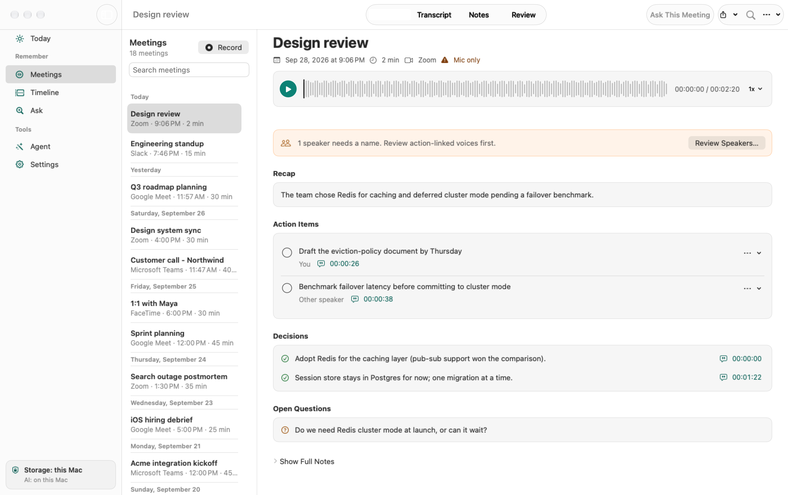
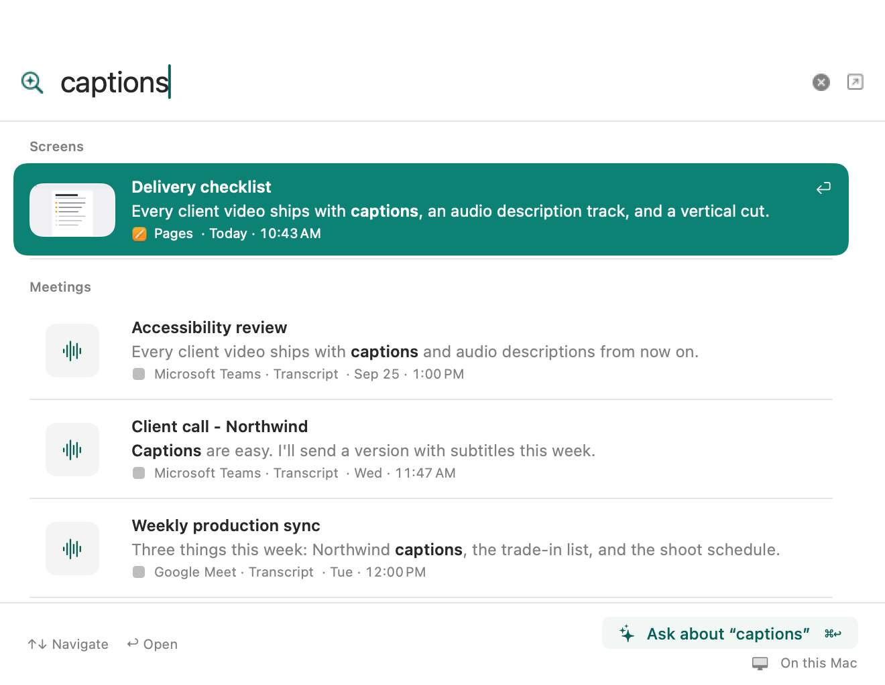
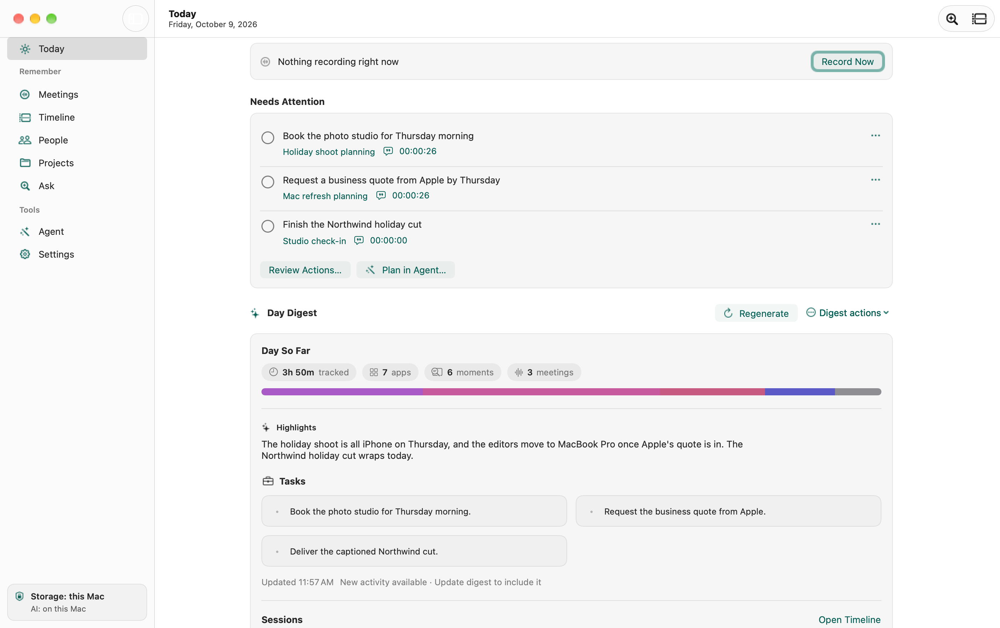
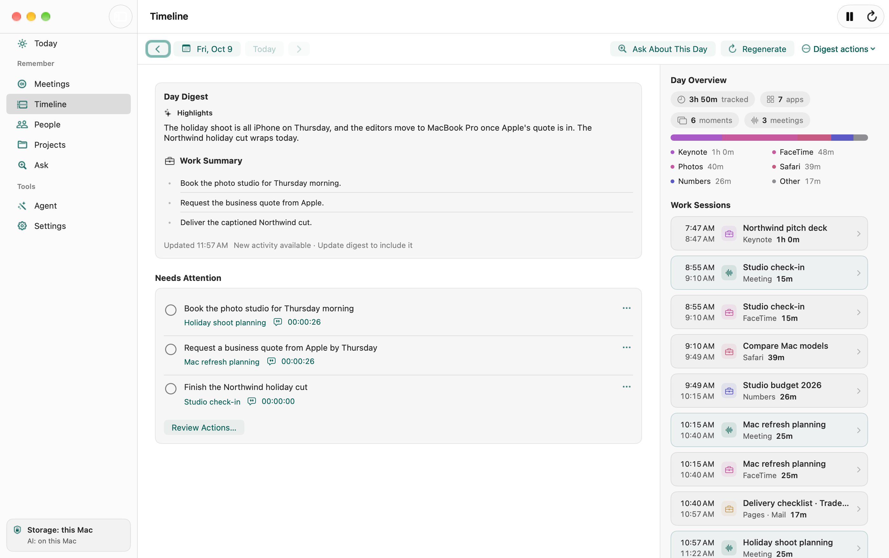
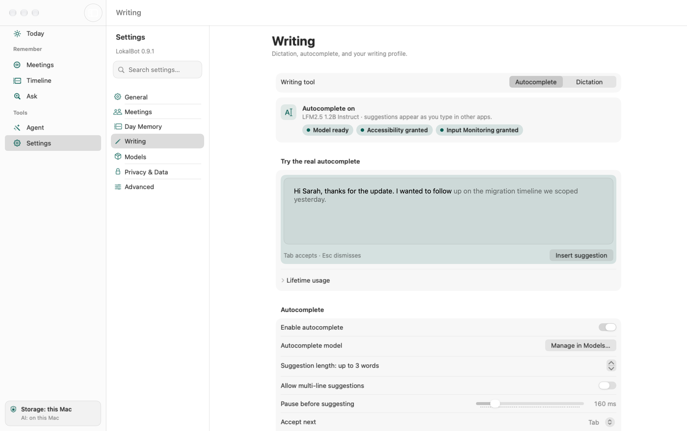
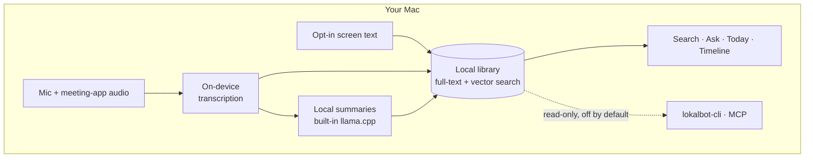

<div align="center">


# LokalBot

**Find what you said or saw on your Mac.**

Private meeting notes, workday recall, dictation, and autocomplete—with AI that runs on your Mac.<br />
Free and open source. No account. Nothing joins your calls.

[](https://github.com/stevyhacker/lokalbot/releases/latest/download/LokalBot.dmg)

<sub>Apple Silicon (M1 or later) · macOS 15+ · or <code>brew install --cask stevyhacker/tap/lokalbot</code></sub>

[](https://github.com/stevyhacker/lokalbot/releases/latest)
[](https://github.com/stevyhacker/lokalbot/releases)
[](LICENSE)
[](#for-developers--agents)

[Features](#features) · [Compare](#how-it-compares) · [Privacy](#privacy) · [Get started](#get-started) · [Models](#local-ai-your-choice) · [Agents & CLI](#for-developers--agents) · [Website](https://www.lokalbot.com/)

</div>

<a id="see-it-in-action"></a>

https://github.com/user-attachments/assets/d9cf34ff-6367-4964-830a-5c7ee1343555

<div align="center"><sub>45 seconds: why LokalBot keeps what you heard and saw, which local models do the work, then the real app in use. Fictional demo data.</sub></div>

## Features

### Remember what was agreed

Record microphone and meeting-app audio without a bot joining. Get local transcripts, recaps, decisions, and action items, with citations back to the discussion.

<div align="center"><a href="Assets/screenshots/meetings-summary.png"></a></div>

### Find something you saw

One search across your meeting transcripts and, if you turn it on, what you saw on screen. Search by keyword or by meaning, then open the matching passage or screen moment instead of hunting through apps.

<div align="center"><a href="Assets/screenshots/quick-recall.png"></a></div>

### Pick up where you left off

Today brings your day digest and open meeting actions together. Timeline groups captured activity into work sessions, with the underlying context available to inspect. Correct actions, mark them done, and trace each one to its source.

<table>
  <tr>
    <td width="50%"><a href="Assets/screenshots/today.png"></a></td>
    <td width="50%"><a href="Assets/screenshots/timeline.png"></a></td>
  </tr>
  <tr>
    <td align="center"><sub><b>Today</b>: your digest and open actions</sub></td>
    <td align="center"><sub><b>Timeline</b>: work sessions and their context</sub></td>
  </tr>
</table>

### Talk instead of typing. Finish the sentence.

Turn on Dictation in **Settings → Writing**, then hold **⌥ Space**, speak, and release to insert text at your cursor in any app. Turn on local Autocomplete in the same place for suggestions as you type: press **Tab** to accept, or keep typing. Transcription and suggestions run on your Mac, and you can rehearse Autocomplete in the app before using it everywhere.

<div align="center"><a href="Assets/screenshots/cotyping.png"></a></div>

### And more

| Ask, then check the source | Follow through | Bring your own agent |
| --- | --- | --- |
| Ask about your meeting library and follow the answer's citations back to the transcript or audio. Generated notes are a starting point, not a substitute for the discussion. | Export notes, or prepare local follow-up drafts, daily briefs, and weekly work logs in a folder you choose. You review and send them yourself. | Give Claude Code or any MCP client read-only access to your meeting library through the bundled `lokalbot-cli`. It stays off until you enable it. |

<sub>Screenshots are unedited captures of the native app with fictional demo data. They show the interface, not a live inference benchmark. Click an image for full resolution; see the <a href="Assets/screenshots/README.md">capture notes</a> for provenance.</sub>

## How it compares

| Coming from… | What's different with LokalBot |
| --- | --- |
| [Granola](https://www.lokalbot.com/lokalbot-vs-granola) | The same bot-free capture, but transcription and summaries run on your Mac by default. No account and no subscription. |
| [Otter](https://www.lokalbot.com/lokalbot-vs-otter) · [Fireflies](https://www.lokalbot.com/lokalbot-vs-fireflies) | Nothing joins your call, audio stays on your Mac, and there are no minute caps. |
| [Hyprnote (anarlog)](https://www.lokalbot.com/lokalbot-vs-hyprnote) | Local AI ships built in, with no separate model runner or API keys to set up. Dictation, a day timeline, and autocomplete come in the same app. |
| [Screenpipe](https://www.lokalbot.com/lokalbot-vs-screenpipe) | Starts with app and window activity. Screen text and screenshots are opt-in and deleted after 14 days by default. GPLv3 rather than source-available. |
| [Rewind](https://www.lokalbot.com/lokalbot-vs-rewind) | Rewind's Mac app is discontinued. LokalBot's timeline is open source and actively developed. |
| [MacWhisper](https://www.lokalbot.com/lokalbot-vs-macwhisper) · [Superwhisper](https://www.lokalbot.com/lokalbot-vs-superwhisper) | Dictation comes alongside meeting notes, recall, and autocomplete, for free. For transcribing files you already have, MacWhisper is the better tool. |

<sub>Competitor details were last verified on September 24, 2026; each link has the full comparison and sources. Trademarks belong to their owners.</sub>

<a id="privacy--verify-it"></a>

## Privacy

**Your work is personal. Keeping it local should be the starting point.**

Recording and built-in AI processing happen on your Mac. LokalBot has no account system, analytics service, or telemetry backend. Your library lives in local files and SQLite under your macOS account.


```mermaid
flowchart LR
  subgraph mac [Your Mac]
    direction LR
    audio["Mic + meeting-app audio"] --> asr["On-device<br/>transcription"]
    asr --> llm["Local summaries<br/>built-in llama.cpp"]
    screen["Opt-in screen text"] --> db[("Local library<br/>full-text + vector search")]
    asr --> db
    llm --> db
    db --> use["Search · Ask · Today · Timeline"]
    db -.->|read-only, off by default| cli["lokalbot-cli · MCP"]
  end
```

- **You choose what to retain.** Activity-only tracking is the default. Visible screen text and encrypted screenshots are opt-in. Pause capture or exclude apps and domains at any time. Detection has limits; exclude anything you never want retained.
- **You control retention.** Captured screen text and screenshots expire after 14 days by default. Adjust the window or explicitly save a moment to keep it until you unsave or delete it.
- **Network access has boundaries.** Models, updates, and optional agent runtimes need downloads. Automatic update checks can be disabled. A remote model server receives context only after you approve its origin; optional Agent Mode and external CLI/MCP clients have separate permissions and data handling.

To check the local processing path, download the models, select the built-in backend, disable automatic update checks, and observe network traffic while recording, transcribing, and summarizing. Approved agent commands and external clients are separate paths.

[Read the full privacy policy](PRIVACY.md) · [Report a security issue privately](SECURITY.md)

<a id="download"></a>

## Get started

You'll need an **Apple Silicon Mac running macOS 15 or later** and space for your selected models. **Settings → Models** shows download sizes and readiness; storage and memory needs depend on the models you choose.

1. **Install the app.** [Download LokalBot.dmg](https://github.com/stevyhacker/lokalbot/releases/latest/download/LokalBot.dmg), drag LokalBot to Applications, and open it. Or run `brew install --cask stevyhacker/tap/lokalbot`.
2. **Choose what to capture.** Review recording settings: automatic detection, ask-first, or manual recording. Day tracking starts with activity only; saving screen text or screenshots is a separate opt-in. Grant only the permissions for the features you enable.
3. **Let the models download.** Built-in transcription, search, summaries, and writing can then work offline. No model server to set up and no API key to bring.

**Try this first:** make a short test recording, let it transcribe, then search for a phrase you said and open the matching passage. Add screen memory or writing tools when you're ready.

Let meeting participants know before recording and get their consent.

[Release notes](https://github.com/stevyhacker/lokalbot/releases) · [Setup help](SUPPORT.md) · [Homebrew options](Distribution/homebrew/README.md)

## FAQ

<details>
<summary><strong>Does a bot join my meetings?</strong></summary>

No. LokalBot records your microphone and the meeting app's audio on your Mac. Audio sources are separate from individual speaker identification. When system-audio capture is unavailable, the app warns that recording is microphone-only. Always record with participants' consent.

</details>

<details>
<summary><strong>Does it record everything on my screen?</strong></summary>

No. New installs use activity-only tracking, which you can turn off. Saving visible text or screenshots requires a separate choice and the relevant macOS permissions. Excluded apps and domains and secure fields are skipped; private browser windows are captured unless you exclude the browser or site. Detected credentials are redacted and associated pixels are dropped, but detection is not perfect. See [PRIVACY.md](PRIVACY.md).

</details>

<details>
<summary><strong>Can I take my notes elsewhere?</strong></summary>

Yes. Export meeting content or enable Markdown, Obsidian, or Logseq memory exports. Local routines can also save drafts to a folder you choose. These Markdown exports are ordinary, unencrypted files; any service you sync them with has its own privacy settings.

</details>

## Local AI, your choice

Start with the built-in models, then change them in **Settings → Models**. LokalBot supports its bundled llama.cpp runtime, Ollama, OpenAI-compatible servers, and Apple Intelligence on supported Macs running macOS 26 or later. Remote servers require approval before receiving context.

Different jobs use different models. These are the defaults on a fresh install, about 6.8 GB of model files if you use every role. They are not a RAM requirement:

| Role | Default model | Format | Approx. model files |
| --- | --- | --- | ---: |
| Transcription | Qwen3-ASR 1.7B | MLX 8-bit | 2.47 GB |
| Summaries and chat | Qwen3.5 4B | `Q4_K_M` | 2.74 GB |
| Autocomplete | LFM2.5 1.2B Instruct | `Q4_K_M` | 0.73 GB |
| Semantic search | Harrier OSS v1 0.6B | `Q8_0` | 0.64 GB |
| Speaker diarization | Nemotron 3 (preview) via FluidAudio | Core ML | ~0.20 GB |

Qwen3-ASR covers 52 languages and dialects. Transcription alternatives include Parakeet, Granite Speech, Whisper large-v3 turbo, SenseVoice for Chinese, Japanese, and Korean, and GigaAM for Russian; Pyannote Community-1 remains available for diarization. Model choices can vary by release; Settings shows the active selections and available presets. Speed and memory use depend on your Mac, model, context length, and other workloads.

[Project benchmarks](https://huggingface.co/spaces/stevyhacker/lokalbot-benchmarks) · [Model catalog](LokalBot/Engines/ModelCatalog.swift) · [Search implementation](LokalBot/Services/EmbeddingIndex.swift) · [Model and runtime details](DEVELOPMENT.md#built-in-llm-runtime--llamacpp--model-catalog)

## For developers & agents

The app bundles **`lokalbot-cli`**, a read-only interface to your meeting library and a stdio **Model Context Protocol (MCP)** server. Access is off by default. Enable meeting-library access in **Settings → Privacy & Data**, then install the CLI from **Settings → Advanced → Agent CLI**.

<div align="center"></div>

```bash
lokalbot-cli search "database decision"
lokalbot-cli get latest --include metadata,summary
lokalbot-cli mcp
```

Without a PATH installation, use `/Applications/LokalBot.app/Contents/Helpers/lokalbot-cli`.

Screen-memory MCP tools require separate permission scoped to today, the last seven days, or all retained history. They return text and metadata, not decrypted screenshots. External clients may send results to their own model providers.

The app also has an optional **Agent Mode** for working with reviewed context. File and shell actions follow its approval settings; it is separate from the read-only CLI/MCP interface.

[CLI examples](.agents/skills/lokalbot-cli/SKILL.md) · [Claude Code plugin](Distribution/claude-plugin/README.md) · [MCP architecture](DEVELOPMENT.md#agent-cli--mcp)

## Build from source

Use an Apple Silicon Mac with full Xcode installed; the [build workflow](.github/workflows/build.yml) pins the CI toolchain. With Homebrew available:

```bash
brew install xcodegen cmake

git clone https://github.com/stevyhacker/lokalbot.git
cd lokalbot

# XcodeGen needs these paths before the first build fetches the runtimes.
mkdir -p Vendor/llama-cpp Vendor/sherpa-onnx
xcodegen generate
open LokalBot.xcodeproj
```

Select **LokalBot Dev**, set your signing team, and run. The Dev app has its own identity, macOS permission grants, library, model storage, and Keychain namespace, so it can live alongside the installed release without applying development retention settings to release data. The first build prepares pinned native runtimes; model downloads happen separately.

[Build and test commands](DEVELOPMENT.md#build-workflows) · [Testing guide](DEVELOPMENT.md#testing) · [Screenshot guide](Docs/screenshot-kit.md)

<details>
<summary><strong>Find your way around the code</strong></summary>

```text
LokalBot/
├── Views/       # Native SwiftUI screens, settings, and onboarding
├── Services/    # Recording, search, storage, and workday memory
├── Engines/     # Transcription, model catalog, and local inference
├── Cotyping/    # System-wide autocomplete
├── Dictation/   # Voice typing
└── Agent/       # Optional Agent Mode and approval flow
CLI/             # Command-line interface and MCP entry points
LokalBotTests/   # Unit tests
Scripts/         # Build, verification, capture, and release tooling
project.yml      # XcodeGen source of truth
```

</details>

<a id="contributing--security"></a>

## Contributing

Bug reports, documentation improvements, and code contributions are welcome. [Report an issue](https://github.com/stevyhacker/lokalbot/issues/new/choose) with steps to reproduce, expected and actual behavior, app/macOS versions, Mac chip/RAM, and selected models. Keep private recordings and transcripts out of reports.

For larger changes, [open an issue](https://github.com/stevyhacker/lokalbot/issues) to discuss the approach first. Follow the [working agreements](AGENTS.md) and [development guide](DEVELOPMENT.md), keep pull requests focused, and record your checks in the [PR template](.github/PULL_REQUEST_TEMPLATE.md). Include screenshots for UI changes; run UI tests on hosted CI or a remote runner.

## License & acknowledgements

LokalBot is free software under [GPLv3](LICENSE). Third-party components and models retain their own licenses; see [third-party notices](THIRD_PARTY_NOTICES.md).

Built with [llama.cpp](https://github.com/ggml-org/llama.cpp), [MLX Swift](https://github.com/ml-explore/mlx-swift), [speech-swift](https://github.com/soniqo/speech-swift), [sherpa-onnx](https://github.com/k2-fsa/sherpa-onnx), [WhisperKit](https://github.com/argmaxinc/WhisperKit), [FluidAudio](https://github.com/FluidInference/FluidAudio), [Sparkle](https://github.com/sparkle-project/Sparkle), and [XcodeGen](https://github.com/yonaskolb/XcodeGen), with models including [Qwen3-ASR](https://huggingface.co/Qwen), [IBM Granite Speech](https://huggingface.co/ibm-granite), [Parakeet](https://huggingface.co/nvidia), and [LFM2.5](https://huggingface.co/LiquidAI). The Autocomplete engine shares its loop with [Cotabby](https://cotabby.app).
